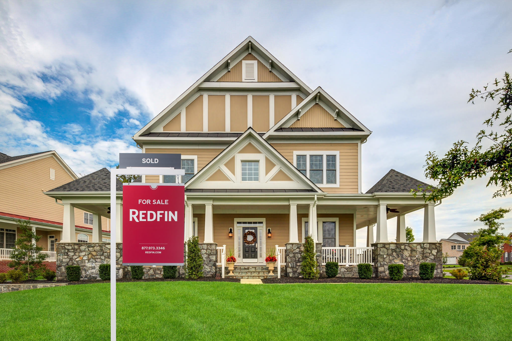

```{r setup, include=FALSE}
knitr::opts_chunk$set(warning = FALSE, echo = TRUE, message = FALSE)
```
## Introduction
For our project, we rely on Redfin as our primary data source for its reliability and real-time updates from local multiple listing services. This real estate brokerage offers direct access to data, allowing us to explore timely values and analyze the dynamic real estate landscape comprehensively. Notably, our focus is on median sale and listed prices, as individual listings and outliers are not accessible in our dataset. Additionally, information on property square footage is not available. Despite these limitations, our use of Redfin's extensive dataset aims to provide valuable insights into county-level housing market trends and contribute to a more informed understanding of broader market conditions.
</center>

{width=40%}

Source:
https://www.redfin.com/news/data-center/

## Questions
- How do the median sale prices of different property types compare over the years in Texas counties?
- How do these trends for individual property types appear?
- Which property type was purchased the most throughout the years?
- What did the median sale prices look like in 2020 compared to 2023?
- How does the median listing price compare to the sold price in Harris County?
- In Harris County, which season is the most popular for buying/selling?
- In 2023, which counties are the most expensive to purchase a home in?
- In 2023, which counties are the least expensive to purchase a home in?


## Libraries Used
```{r}
library(kableExtra) # Useful to create a nicely formatted table.
library(viridis) # Provides color palettes suitable for data visualization.
library(tidyverse)  # Useful for data manipulation tasks and visualization.
library(data.table) # Useful to transform the tsv file to a csv file making it easier to read and to use for data manipulation.
library(urbnmapr) # Useful for creating geographic visualizations, as seen in mapping Texas counties.
library(viridisLite) # A lightweight version of viridis for color palettes.
# Read TSV file using fread() from data.table
# tskv_file <- "county_market_tracker.tsv000"
# data <- fread(tskv_file)
# # CSV file
# csv_file <- "output_file.csv"
# fwrite(data, file = csv_file)
# housingdata2 <- read.csv(csv_file)
texas_data <- read_csv("texas_data.csv")
```

## Filtering Data Just to State of Texas
The original TSV file contained all the counties across the United States, making the data too large. To address this, we decided to focus solely on the state of Texas and the variables we chose to work with.
```{r}
# #texas_data <- housingdata2 %>%
#   select(period_begin, period_end, region, state, property_type, homes_sold, 
#          median_sale_price, median_ppsf, median_list_price, new_listings, 
#          inventory) %>%                
#   filter(state == "Texas") %>%
#   filter(!is.na(homes_sold) & !is.na(median_sale_price) & !is.na(median_ppsf))

```

```{r, echo=FALSE}
#The dates were classified as a character so right here we're just changing it to numeric
texas_data <- texas_data %>% 
  mutate(
    period_begin = as.Date(period_begin),
    period_end = as.Date(period_end),
    month_begin = month(period_begin),
    day_begin = day(period_begin),
    year_begin = year(period_begin),
    month_end = month(period_end),
    day_end = day(period_end),
    year_end = year(period_end)
  )

texas_counties <- texas_data %>%
  filter(str_detect(region, ", TX"))
texas_counties$region <- gsub(", TX", "", texas_counties$region)


```
## Property types through the years
This picture shows how home prices in Texas have moved from 2012 until now. We're looking at different types of homes, and the lines and colors help us understand the details. What we can see is that, overall, home prices have mostly gone up. This suggests that it might be a good time to invest in real estate in Texas, even though there are times when prices take a small dip. If you're looking for a more budget-friendly option, condos seem to be consistently cheaper.
There's a drop in the graph for 2023, but that's because we only have information until October. We're still collecting data for the rest of the year, so that drop might not be as big as it looks. We need more info to get the full picture.
```{r, echo=FALSE}
texas_data %>%
  group_by(property_type, year_end) %>%
  summarise(avg_median_price = mean(median_sale_price, na.rm = TRUE)) %>%
  ggplot(aes(x = year_end, y = avg_median_price, color = property_type)) +
  geom_line() +
  geom_point() +
  labs(title = "Average Median Sale Price Trends by Property Type",
       x = "Year",
       y = "Average Median Sale Price",
       color = "Property Type") +
  theme_minimal() +
  scale_color_brewer(palette = "Set1")
```

## Extra Graphs 
```{r, echo=FALSE}
average_prices <- texas_data %>%
  group_by(property_type, year_end) %>%
  summarise(avg_median_price = mean(median_sale_price, na.rm = TRUE))

ggplot(average_prices, aes(x = year_end, y = avg_median_price)) +
  geom_line() +
  labs(title = "Average Median Sale Price Trend for Texas Counties",
       x = "Year",
       y = "Average Median Sale Price") +
  facet_wrap(~ property_type, scales = "free_y") +
  theme_minimal()

```

## Distribution of property types sold through the years
This chart shows how the kinds of homes sold in Texas have changed over time. Each bar is a different type of property. What's interesting is that, overall, it has stayed pretty consistent through the years..
```{r, echo=FALSE}
ggplot(texas_data, aes(x = property_type, fill = property_type)) +  
  geom_bar() +
  labs(title = "Property Types Sold Throughout the years",
       x = "Property Type",
       y = "Count") + 
  coord_flip() + facet_wrap(~ year_end)
```

```{r, echo=FALSE}
newtexas <- texas_counties %>% 
  select(region, state, median_sale_price, year_end) %>%                
  filter(year_end == 2023) %>% 
  group_by(region, state) %>% 
  summarise(average_county = mean(median_sale_price, na.rm = TRUE))

newtexas2020 <- texas_counties %>% 
  select(region, state, median_sale_price, year_end) %>%                
  filter(year_end == 2020) %>% 
  group_by(region, state) %>% 
  summarise(average_county = mean(median_sale_price, na.rm = TRUE))

texas_data_2023 <- texas_data %>%
  filter(year_end == 2023)

# Filter data for the year 2020
texas_data_2020 <- texas_data %>%
  filter(year_end == 2020)
```

## What was the median sale price like across Texas counties in 2020?
Let's look at how much homes cost in different Texas counties in 2020. Notice the counties marked in orange - this will matter when we compare prices in 2023. What stands out is that many areas were orange, indicating that most home prices fell between 100 and 200k.
```{r, echo=FALSE}
#devtools::install_github("UrbanInstitute/urbnmapr")

newtexas_map2 <- left_join(newtexas2020, counties, by = c("region" = "county_name")) %>%
  filter(state_name == "Texas") 

price_categories <- c("< $100,000", "$100,000 - $200,000", "$200,000 - $300,000", "> $300,000")
price_colors <- c("#66c2a5", "#fc8d62", "#8da0cb", "#e78ac3")  # Choose your own colors

# color categories and corresponding price ranges
price_categories2 <- c("< $100,000", "$100,000 - $200,000", "$200,000 - $300,000", "> $300,000")
price_colors2 <- c("#66c2a5", "#fc8d62", "#8da0cb", "#e78ac3")  

# Create a factor variable for fill with the defined categories
newtexas_map2$price_category <- cut(newtexas_map2$average_county,
                                   breaks = c(-Inf, 100000, 200000, 300000, Inf),
                                   labels = price_categories,
                                   include.lowest = TRUE)

# Plot using ggplot 
ggplot(data = newtexas_map2, aes(long, lat, group = group, fill = price_category)) +
  geom_polygon(color = "#ffffff", size = 0.25) +
  scale_fill_manual(values = setNames(price_colors, price_categories)) +
  coord_map(projection = "albers", lat0 = 27, lat1 = 35, xlim = c(-106, -93), ylim = c(25, 37)) +
  theme(legend.title = element_text(),
        legend.key.width = unit(0.5, "in")) +
  labs(fill = "Average Median Sale Price in Texas Counties 2020")

```

## What was the median sale price like across Texas counties in 2023?
Let's check out how much homes cost in different Texas counties in 2023. Uh-oh! The counties seem to be more pink and purple this time, indicating that houses are now mostly in the 200-300k range (or above!). This trend is especially noticeable on the west side of Texas.
```{r, echo=FALSE}

newtexas_map <- left_join(newtexas, counties, by = c("region" = "county_name")) %>%
  filter(state_name == "Texas") 

# Define color categories and corresponding price ranges


newtexas_map$price_category <- cut(newtexas_map$average_county,
                                   breaks = c(-Inf, 100000, 200000, 300000, Inf),
                                   labels = price_categories,
                                   include.lowest = TRUE)

# Plot using ggplot with discrete color boxes
ggplot(data = newtexas_map, aes(long, lat, group = group, fill = price_category)) +
  geom_polygon(color = "#ffffff", size = 0.25) +
  scale_fill_manual(values = setNames(price_colors, price_categories)) +
  coord_map(projection = "albers", lat0 = 27, lat1 = 35, xlim = c(-106, -93), ylim = c(25, 37)) +
  theme(legend.title = element_text(),
        legend.key.width = unit(0.5, "in")) +
  labs(fill = "Average Median Sale Price in Texas Counties 2023")

```

## Which counties are the most expensive to purchase a home in 2023?
In 2023, certain Texas counties stand out as the most expensive places to buy a home. Topping the list is Edwards County, TX, with an average median sale price of $1,036,750. Following closely are Gillespie County, TX, at $594,590.7, Kendall County, TX, at $522,590.6, and Somervell County, TX, with an average of $503,335. Travis County, TX, rounds out the notable areas with an average median sale price of $498,107.6. It's important to note that while these figures highlight the cost of purchasing a home, we do not have information on specific property characteristics such as land size, house size, or the number of bedrooms in these areas.
```{r, echo=FALSE}
avghome <- texas_data_2023 %>%
  group_by(region) %>%
  mutate(avg_median_sale_price = mean(median_sale_price, na.rm = TRUE)) %>%
  select(region, avg_median_sale_price) %>%
  distinct()  %>%   arrange(desc(avg_median_sale_price))

head(avghome, 5)

top5_avghome <- head(avghome, 5)

ggplot(top5_avghome, aes(x = fct_reorder(region, avg_median_sale_price), y = avg_median_sale_price)) +
geom_bar(stat = "identity", fill = "pink") +
labs(title = "Top 5 Regions by Average Median Sale Price",
x = "Region",
y = "Average Median Sale Price") +
theme_minimal() +
theme(axis.text.x = element_text(angle = 10, hjust = 1))

```


## Which counties are the least expensive to purchase a home in during 2023?
When it comes to affordability in home purchases during 2023, certain Texas counties emerge as the least expensive options. Foard County, TX, takes the lead with an average median sale price of $58,000. Following closely are Terrell County, TX, at $59,166.67, Dickens County, TX, at $61,633.33, and Schleicher County, TX, with an average of $69,300. Cottle County, TX, rounds out the list with an average median sale price of $72,925. These figures provide insights into regions where homebuyers can find more budget-friendly options
```{r, echo=FALSE}
avghome2 <- texas_data_2023 %>%
  group_by(region) %>%
  mutate(avg_median_sale_price = mean(median_sale_price, na.rm = TRUE)) %>%
  select(region, avg_median_sale_price) %>%
  distinct()  %>%   arrange(avg_median_sale_price)


cheap5 <- head(avghome2,5)
cheap5

ggplot(cheap5, aes(x = fct_reorder(region, avg_median_sale_price), y = avg_median_sale_price)) +
geom_bar(stat = "identity", fill = "pink") +
labs(title = "Top 5 Regions by Average Median Sale Price",
x = "Region",
y = "Average Median Sale Price") +
theme_minimal() +
theme(axis.text.x = element_text(angle = 10, hjust = 1))

```

## Let's take a thorough look at all the counties in Texas and how their listed and sold prices compare in 2023
A comprehensive examination of real estate transactions across Texas in 2023 reveals intriguing insights into the relationship between listed and sold prices. Notably, certain counties experienced homes selling for less than their listed prices, while others saw homes fetching prices surpassing their initial listings. For instance, Edwards County stands out with a median sale price of $1,036,750, significantly exceeding its median list price of $500,250. This pattern is evident across various counties in the table, showcasing the diverse dynamics of the real estate market in Texas during 2023.
```{r, echo=FALSE}
scrollbox <- texas_data_2023 %>%
  group_by(region) %>%
  summarize(
    median_sale_price = mean(median_sale_price, na.rm = TRUE),
    median_list_price = mean(median_list_price, na.rm = TRUE)
  ) %>%
  arrange(desc(median_sale_price)) %>%
  kbl() %>%
  kable_paper() %>%
  scroll_box(height = "300px")

scrollbox
```

## Now let's take a closer look at Harris County!
```{r}
harris_county <- texas_data %>% filter(region == "Harris County, TX") %>% arrange(period_begin) 
```

## How does the median price listing compare to the price sold in Harris County?
Let's take a closer look at home prices in Harris County. What we notice over the years is that the prices homes are listed for consistently tend to be higher than what they eventually sell for. The graph illustrates this pattern clearly, highlighting that in just ten years, home prices have doubled. It's interesting to note that while both median sale prices and listing prices continue to increase, the pace of increase in listing prices is notably higher. This gives us valuable insights into how the housing market in Harris County is evolving, with listed prices on a steeper climb compared to actual sold prices.
```{r, echo=FALSE}
harris_county_monthly <- harris_county %>%
  group_by(year_begin, month_begin) %>%
  summarise(
    median_list_price = mean(median_list_price),
    median_sale_price = mean(median_sale_price)
  )


ggplot(harris_county_monthly, aes(x = year_begin + month_begin/12)) +
  geom_line(aes(y = median_list_price, color = "Median Listing Price")) +
  geom_line(aes(y = median_sale_price, color = "Median Sales Price")) +
  labs(title = "Comparison of Median Listing and Median Sales Prices in Harris County, TX, Over the Years",
       x = "Year",
       y = "Price",
       color = "Legend") +
  scale_color_manual(values = c("Median Listing Price" = "blue", "Median Sales Price" = "red")) +
  theme_minimal()
```

## Which season is the most popular for buying and selling homes in Harris County?
Looking at the graph, the bars show us how many homes were sold in different seasons. It's clear that summer and spring are the most popular times for buying homes. What caught our attention is that in the winter of 2020, it unexpectedly became the second busiest season, which is a bit unusual.

Now, keep in mind that this observation might not be entirely accurate, but it got us thinking. Could there be a connection to the timing of COVID-19? It's an interesting idea that we might want to look into further. This simple analysis helps us understand how the seasons could be linked to bigger events like the pandemic, giving us a glimpse into how people buy homes in Harris County.
```{r, echo=FALSE}
texas_data <- texas_data %>%
  mutate(
    season_begin = case_when(
      month_begin %in% c(3, 4, 5) ~ "Spring",
      month_begin %in% c(6, 7, 8) ~ "Summer",
      month_begin %in% c(9, 10, 11) ~ "Fall",
      month_begin %in% c(12, 1, 2) ~ "Winter",
      TRUE ~ NA_character_
    ),
    season_end = case_when(
      month_end %in% c(3, 4, 5) ~ "Spring",
      month_end %in% c(6, 7, 8) ~ "Summer",
      month_end %in% c(9, 10, 11) ~ "Fall",
      month_end %in% c(12, 1, 2) ~ "Winter",
      TRUE ~ NA_character_
    )
  )

harris_county <- texas_data %>% filter(region == "Harris County, TX") %>% arrange(period_begin) 


ggplot(harris_county, aes(x = factor(year_begin), y = homes_sold, fill = season_begin)) +
  geom_bar(stat = "identity", position = "dodge") +
  labs(title = "Homes Sold Over the Years in Harris County, TX, by Season",
       x = "Year",
       y = "Homes Sold") +
  scale_fill_manual(values = c("Spring" = "#7cc969", "Summer" = "#f089b8", "Fall" = "#e4832f", "Winter" = "#1da4b4")) +
  theme_minimal() +
  theme(axis.text.x = element_text(angle = 45, hjust = 1))
```


## Summary
To conclude, our exploration today involved an analysis utilizing Redfin's comprehensive data on county-level housing market trends. The primary objective was to illuminate regions offering affordability compared to those on the pricier side, providing valuable insights for potential movers. We thoroughly investigated the impact of seasons on market activity, uncovering notable trends. However, it's essential to acknowledge the dataset's limitations, including the absence of detailed property information such as the year of construction, bedroom and restroom counts, property size, and total square footage. These gaps hinder a more nuanced understanding. Significantly, our analysis could have been greatly enriched with additional property-specific details. Despite these limitations, Redfin's dataset has enabled us to draw meaningful insights, contributing to a more informed understanding of county-level housing market conditions.


